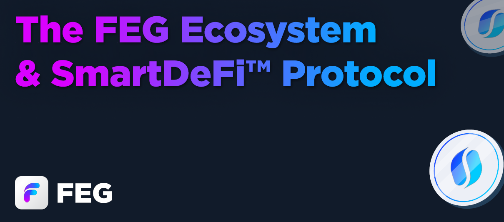

# 💡 介绍

<figure><figcaption></figcaption></figure>

### 🌍 关于 [FEG.io](https://fegtoken.com/)&#x20;

FEG 是一个专注于去中心化金融（DeFi）的项目，提供下一代代币启动平台“SmartDeFi”，并已通过严格的[审计](welcome/security-audits.md)。目前，FEG 部署在 ETH、BNB 和 BASE 区块链上，计划扩展到更多兼容 EVM 的链，进一步扩大生态系统的覆盖范围和能力。

### 🌉 跨链协议开发

FEG 开发了一个跨链协议，使 **单一代币供应** 可以在多个区块链上无缝流通。这一尖端技术在 DeFi 领域中独树一帜，并已通过严格审计以确保其稳健性和安全性。

### 💼 SmartDeFi 代币启动平台

我们的代币启动平台具有强大的功能，支持创新的投资策略：

* 多资产支持：投资者可以通过多个资产（如 ETH、USDC 等）支持代币。
* 灵活赎回与贷款：代币可按资产支持值销毁，或投资者可选择对其代币进行无息 30 天的贷款。
* 自适应代币经济：项目可以调整其代币经济结构，以更好地符合项目发展目标或投资者的策略，调整前需延迟 3 天进行安全审查。
* RFI 技术集成：我们加强了 RFI 技术的集成，提供 RFI 与非 RFI 的选择，优化功能和投资效果。
* 抵押协议部署器：使用我们定制的、经过全面审计的抵押协议，为项目带来即时的实用性和增强的价值。
* 无代币预售：一种开创性的预售方法，投资者通过提供流动性获得等价美元的代币。赎回时可获得对应的 ETH 或 BNB，销毁等量的代币以维持市场价格并提升预售的安全性。

### 🏛 现实资产代币化

我们的启动平台现支持现实资产的代币化，允许通过我们审计的抵押协议进行无缝的股息分配，使数字资产和现实资产之间有更深的联系。

### 📱 FEGtrack 应用程序

FEG 开发了 FEGtrack 应用程序，提供项目信息、图表、市场动态和新闻更新。可在 Android 和 iOS 下载，搜索“FEGtrack”即可找到。

### 🔗 SmartDeFi 交易/图表平台

探索我们定制的交易和图表平台，所有启动的代币均可在此平台上进行交易。该平台通过 UniSwap 和 PancakeSwap 路由并集成 TradingView 提供的工具。访问：[SmartDeFi.com](https://smartdefi.com)！

### 生态系统

<table data-view="cards" data-full-width="false"><thead><tr><th></th><th></th><th></th><th data-hidden data-card-cover data-type="files"></th><th data-hidden data-card-target data-type="content-ref"></th></tr></thead><tbody><tr><td><strong>FEG 代币</strong></td><td><em>原生生态系统代币</em></td><td><a href="feg-smartdefi-tm/about-feg-token/">阅读更多</a></td><td><a href=".gitbook/assets/FEG smaller.png">FEG smaller.png</a></td><td><a href="feg-smartdefi-tm/about-feg-token/">about-feg-token</a></td></tr><tr><td><strong>SmartDeFi 图表和交换</strong></td><td><em>进行交易和查看代币数据</em></td><td>阅读更多</td><td><a href=".gitbook/assets/FEGex smaller.png">FEGex smaller.png</a></td><td><a href="https://smartdefi.com">https://smartdefi.com</a></td></tr><tr><td><strong>SmartDeFi 启动平台</strong></td><td><em>创建您的免费项目</em></td><td><a href="smartdefi-tm-platform/smartdefi-protocol/">阅读更多</a></td><td><a href=".gitbook/assets/Deployer smaller.png">Deployer smaller.png</a></td><td><a href="smartdefi-tm-platform/smartdefi-protocol/">smartdefi-protocol</a></td></tr><tr><td><strong>Grafene 2FA 钱包</strong></td><td><em>高度安全的热钱包</em></td><td><a href="grafene/grafene.md">阅读更多</a></td><td><a href=".gitbook/assets/Grafene smaller.png">Grafene smaller.png</a></td><td><a href="grafene/grafene.md">grafene.md</a></td></tr><tr><td><strong>FTW 点对点限价单交易</strong></td><td><em>点对点限价单交易</em></td><td><a href="broken-reference">阅读更多</a></td><td><a href=".gitbook/assets/FTW smaller.png">FTW smaller.png</a></td><td><a href="broken-reference">链接损坏</a></td></tr><tr><td><strong>聚合交易</strong></td><td><em>寻找最佳交易价格</em></td><td><a href="aggregator/aggregator-info.md">阅读更多</a></td><td><a href=".gitbook/assets/Aggregator smaller.png">Aggregator smaller.png</a></td><td><a href="aggregator/aggregator-info.md">aggregator-info.md</a></td></tr></tbody></table>

### 社交媒体

<table data-view="cards"><thead><tr><th></th><th data-hidden></th><th data-hidden></th><th data-hidden data-card-target data-type="content-ref"></th></tr></thead><tbody><tr><td><strong>Telegram</strong></td><td></td><td></td><td><a href="https://t.me/FEGchat"> https://t.me/FEGchat</a></td></tr><tr><td>Twitter</td><td></td><td></td><td><a href="https://twitter.com/FEGtoken"> https://twitter.com/FEGtoken</a></td></tr><tr><td>Youtube</td><td></td><td></td><td><a href="https://www.youtube.com/@FEGOfficial">https://www.youtube.com/@FEGOfficial </a></td></tr><tr><td>Discord</td><td></td><td></td><td><a href="https://discord.fegtoken.com">https://discord.fegtoken.com</a></td></tr><tr><td>Instagram</td><td></td><td></td><td><a href="https://www.instagram.com/feg_token/">https://www.instagram.com/feg_token/ </a></td></tr><tr><td>Facebook</td><td></td><td></td><td><a href="https://www.facebook.com/FEGTokenOfficial/">https://www.facebook.com/FEGTokenOfficial/ </a></td></tr><tr><td>Medium</td><td></td><td></td><td><a href="https://fegtoken.medium.com">https://fegtoken.medium.com</a></td></tr><tr><td>Reddit</td><td></td><td></td><td></td></tr><tr><td>Telegram Support</td><td></td><td></td><td><a href="https://support.fegtoken.com">https://support.fegtoken.com</a></td></tr></tbody></table>

### 其他信息

官方网站: [https://feg.io/](https://feg.io/)\\\
交易平台: [https://smartdefi.com](https://smartdefi.com)\\\
在线支持: [https://livesupport.fegtoken.com](https://livesupport.fegtoken.com)

联系邮箱\\\
[info@feg.io](mailto:info@feg.io)\\\
[marketing@feg.io](mailto:marketing@feg.io)
