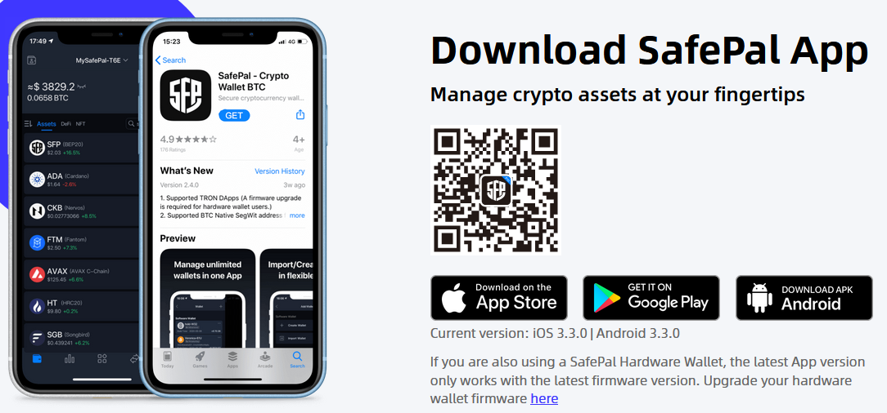

# 创建加密钱包

### 创建您的加密钱包

1. 下载 [Safepal](https://www.safepal.com/en/download) 应用到您的设备；这是最好的钱包之一。
2. 安装钱包应用并按照官方指南[设置您的加密钱包](https://docs.safepal.io/safepal-app/how-to-create-a-safepal-software-wallet)。


务必安全地存储您的助记词，且_绝不要_与任何人分享！\
一旦他人获得您的助记词，他们将可以不受限制地访问您的钱包！


### 将 FEG 添加到您的钱包列表

1. 打开应用并确保处于主屏幕上，底部显示“钱包”。
2. 找到右侧的三个点的菜单。
3. 点击“管理币种”。
4. 在新的搜索字段中输入“FEG”，或使用合约地址搜索：\
   _**0xF3c7CECF8cBC3066F9a87b310cEBE198d00479aC**_
5. 选择适合您的 FEG，例如在 BNB、BASE 或 ETH 上的版本。&#x20;

<figure><figcaption></figcaption></figure>

返回主屏幕后，您会在列表中看到 FEG，包含您拥有的代币数量、每个 FEG 的价格、您持有的总价值等信息。

### 手动将 FEG 添加为自定义代币

在某些钱包中，您可能无法在可用代币的列表中找到 FEG。您可以使用合约地址手动添加它作为自定义代币：\
_**0xF3c7CECF8cBC3066F9a87b310cEBE198d00479aC**_

例如，在 Metamask 钱包中可以手动添加代币，按照下方示例图片中的说明操作即可。

<figure><figcaption></figcaption></figure>
