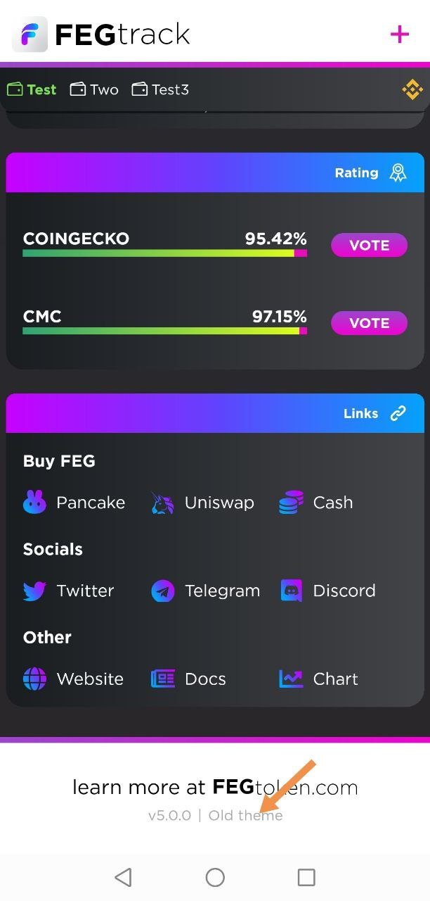
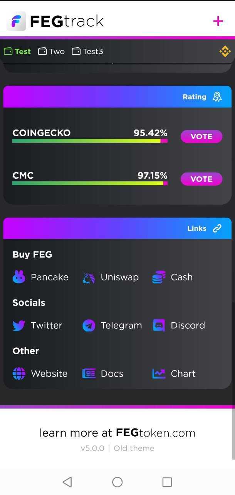
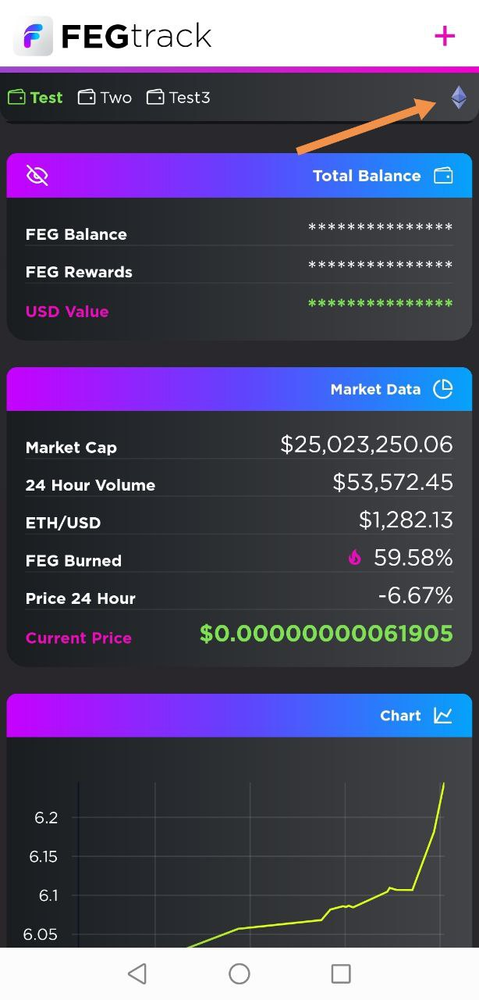
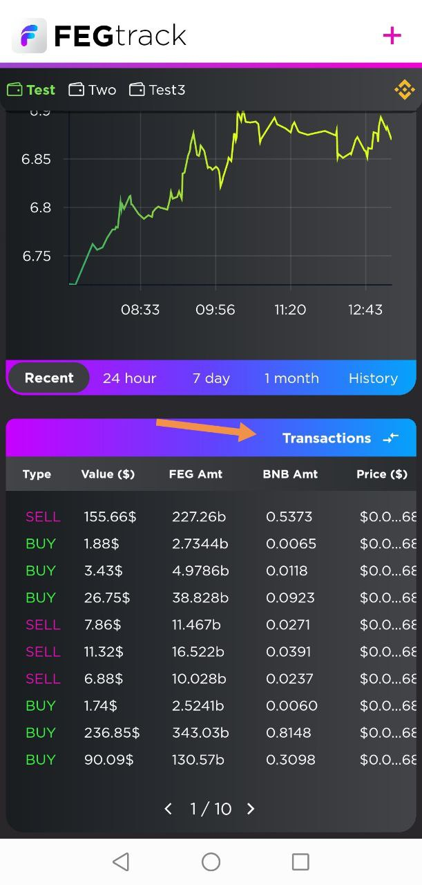

# 📲 FEGtrack 界面


本页面的信息已过时，后续将进行更新


## 1. 切换旧主题和新主题

<figure><figcaption></figcaption></figure>

如果点击应用程序底部的“旧主题”，您可以在两个主题之间切换。

## 2. 菜单移至底部

<figure><figcaption></figcaption></figure>

在应用底部，您可以找到直接链接以在 Coinmarketcap 和 Coingecko 上投票。下面，您可以找到在 Uniswap、PancakeSwap 或 Fiat 等平台上购买 FEG 代币的直接链接。\
\
向下滚动页面，您将找到 FEGtoken 项目维护的各种社交媒体链接。最后，您可以看到已安装的应用版本。

## 3. 添加您的钱包

<figure><figcaption></figcaption></figure>

FEGtrack 是安全的；它不会连接到您的钱包，只是读取您公开钱包地址的持有信息，该地址为 0x...

任何人都可以在区块链上查看公开的钱包地址。\
\
\- 点击加号并在“钱包地址”字段中粘贴您的公开钱包地址。\
\- 然后为您的钱包命名。\
\- 保存后，此名称将显示在应用程序顶部。\
\
您也可以通过扫描 QR 码来添加您的钱包地址。\
\
完成后，点击“保存钱包”按钮将钱包保存在 FEGtrack 中。

## 4. 切换网络

<figure><figcaption></figcaption></figure>

在屏幕顶部附近有一个网络图标，可以让您在 Ethereum 和 Binance Smart Chain 网络之间切换。\
\
请务必选择适用于您 FEG 代币的正确网络，否则余额可能显示为零；如果是这样，请不要惊慌，切换网络即可。

## 5. 切换余额显示

<figure><figcaption></figcaption></figure>

反复点击“总余额”按钮会在仪表板上显示您持有的不同余额。\
\
按钮文本和仪表板统计信息将依次更改如下：\
1. 总余额 / 2. 钱包余额 / 3. 质押 v2 / 4. 质押 v1

## 6. 市场数据

<figure><figcaption></figcaption></figure>

向下滚动，您将找到“市场数据”部分，在这里可以看到市值、交易量、价格、燃烧数量和流通统计数据。\
\
如果按下第 2、3、4 和 6 部分，它们会切换显示更多数据（例如，FEG 燃烧会切换为 FEG 流通比例）。\
\
试试看！

## 7. 交易记录

<figure><figcaption></figcaption></figure>

在应用程序中进一步向下，您将看到“交易记录”部分，可以水平滚动查看最近的 FEGtoken 买卖交易列表。\
\
如果点击“交易记录”，它会切换到“我的交易”。加载可能需要一些时间，将显示您与 FEG 代币的交易，但不会显示转账记录，仅显示买入和卖出交易。

## 8. 更改字体大小

<figure><figcaption></figcaption></figure>

如果按住 FEGtrack 顶部的标志几秒钟，应用程序将切换到较大的字体，适合小屏幕用户。再次按住标志可以恢复默认字体大小。

## 9. 隐藏余额

<figure><figcaption></figcaption></figure>

如果点击左侧类似眼睛的图标，您可以隐藏余额。市场数据和交易记录仍然会显示。
