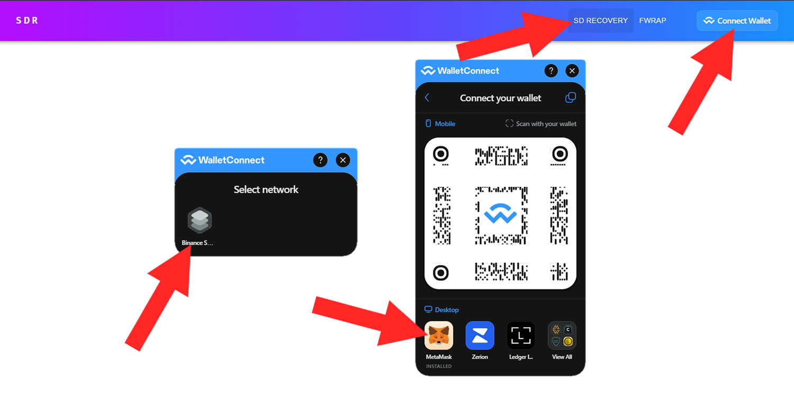

# 👩‍💻 SDR for DEVs


beforePlease let the FEG Team know you are ready to recover in the SD Listings chat t.me/SDlistings prior to beginning.


## Part 1 - How do you unlock your SD project?

### #1 Connect your wallet to the SDR tool

Ensure you're on the "SD RECOVERY" tab, which you can locate at the top, as shown in the example picture.\
\
Next, click "Connect Wallet," select the network your old SD project was on (BSC or ETH), and then proceed with the necessary steps to complete the wallet connection.

Please be aware that these steps may vary depending on your specific wallet type. It's important to note that you should perform this action using the owner wallet associated with your old SD project, not just any random wallet.

<figure><figcaption></figcaption></figure>

### #2 Unlock the funds

* Ensure you are on the "SD RECOVERY" page in the top menu.&#x20;
* Select your old SD project from the dropdown list of projects.
* Click on the "DEVELOPER" tab to access the admin-specific options.
* Next, click the "RESCUE" button and confirm the transaction in your wallet.&#x20;

You have now completed the process, and the funds are unlocked and ready to be recovered by your old investors.

<figure><figcaption></figcaption></figure>

## Part 2 - More admin options after unlocking&#x20;

Now that your project is unlocked and the funds stored within your LP & backing are finally accessible for retrieval, you have a few options and decisions to consider. You can either:

* Allow each investor to claim their share of the stored funds individually.
* Conduct a bulk airdrop of the funds to all your previous investors in one transaction, with the requirement to cover the associated transaction fees.
* Please allow your previous investors to reinvest their funds into a new project you may launch.

Let's examine each option in detail.

### #1 Airdrop funds to your old investors

The SDR tool allows you, as the owner of the SD project, to airdrop the unlocked funds directly to your old investors' wallets, making it convenient for everyone to retrieve their funds at once and ensuring satisfaction all around.

Please be aware that you will be responsible for covering the gas costs associated with this transaction by choosing this option. Given the complexity of the smart contracts underpinning this process, the gas fees could be substantial, necessitating a significant payment to the blockchain.

If you wish to proceed with this method, you must compile a list of all wallet addresses belonging to your previous holders, with each address separated by a comma (example: address1, address2, address3). Afterward, click on the "AIRDROP" button and confirm the transaction.

Your previous holders will now receive their exact share of the fBNB/fETH stored in LP/backing directly to their wallets, with deductions made for the expenses required by the smart contracts for execution.

<figure><figcaption></figcaption></figure>

### #2 Let every investor claim their share individually

This option is relatively self-explanatory. Once you unlock the funds, you are no longer required to take further action. The funds are now accessible for your investors to claim independently, and the guide for them to do so can be found on the "[SDR for Investors](sdr-for-investors.md)" page.

### #3 Claim reinvested funds to start a new SD project

If you persuade your previous investors to support your new SD project and embark on this fresh venture with you, they cannot claim their share of the fBNB/fETH from your old unlocked SD project. Instead, they can reinvest their funds in your new project.

Once users choose the "reinvest" option, project creators may see the amount of fBNB/fETH they've sent in the "Claimable reinvested allocation" field. This represents the funds available for you to withdraw to your wallet. Please exercise diligence in using these funds, as they are entrusted to you by individuals who trust your commitment.

When you believe a sufficient amount of funds has accumulated from your previous investors, you can click the "CLAIM" button to transfer these funds from your old token LP/backing pool to your wallet. This option can be used multiple times. For instance, you can claim 10 fBNB now, and as more previous investors reinvest their funds over the following weeks, you can claim the newly gathered amount as well, and so on.

In the future, after injecting these reinvested funds into your new SD project and launching it, you will need to devise a suitable method to return these funds to your investors, typically through a token distribution such as an airdrop or another approach chosen collectively by you, your developers, and your community—best of luck with your endeavors.

<figure><figcaption></figcaption></figure>
