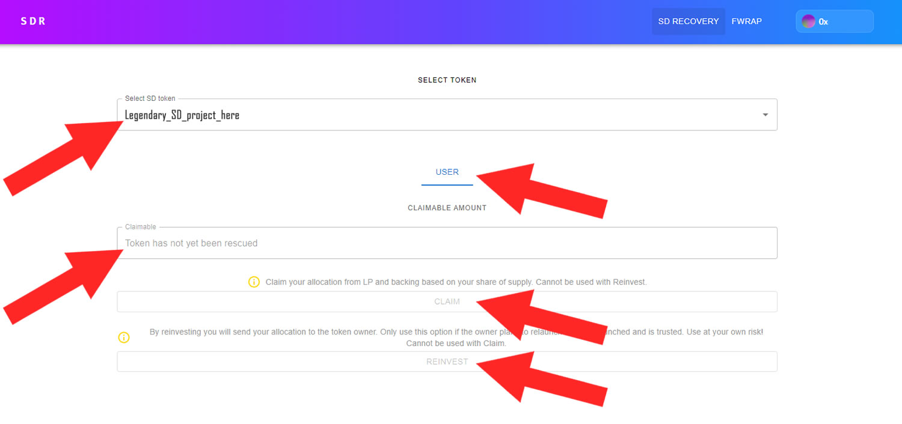

# 👩‍🏫 SDR for Investors

### #1 Connect your wallet to the SDR tool

Ensure you are on the "SD RECOVERY" tab at the top, as shown in the example picture.\
\
Next, click "Connect Wallet," select the network on which your old SD tokens were issued (BSC or ETH), and then proceed with the necessary steps to complete the wallet connection.\
\
Please note that these steps may vary depending on your specific wallet type.

<figure><figcaption></figcaption></figure>

### #2 Recover your funds

* To initiate recovery, select your desirSelectropdown list to start recovery.
* &#x20;Once you've selected, new tabs will appear below, named "USER" and "DEVELOPER." If you are a regular investor in the SD project and not its owner, you will only see the "USER" tab, which is perfectly acceptable.
* On this page, in the "Claimable" section, you will find the amount of fBNB (FEG-wrapped-BNB)you are eligible to receive based on your holdings in the SD project.
* Now, you face a decision. You can either claim these funds and transfer them to your wallet by clicking the "CLAIM" button, or you can choose to "REINVEST" and send these funds to the owner of the old SD project, enabling them to kickstart the launch of a new SD project.
* **If you opt to reinvest your funds, make sure, BEFORE doing so, that the owner of the old SD project is still active and trustworthy. Otherwise, there is a risk of losing your funds. Therefore, conduct your research and make an informed decision.**

<figure><figcaption></figcaption></figure>


If you encounter the grey text "Token has not yet been rescued" in the "Claimable" field, it indicates that the owner of this old SD project has not initiated the recovery procedure. We recommend visiting the social media channels of the respective project and attempting to contact the project's owner. Inform them that "SmartDeFi Recovery" has been publicly launched, and their participation is required to release the funds.


### #3 Receiving your money

* Now that you've clicked "CLAIM," you'll receive your funds as fBNB, the traditional FEG-wrapped BNB. This is because the LP and backing of old SD projects were stored in fBNB, not regular BNB or wBNB.
* To convert fBNB back to regular BNB, navigate to the "FWRAP" page in the top menu on the right.
* This page will present two tabs: "UNWRAP" and "WRAP." You only need to use the "UNWRAP" tab, so click on it.
* In the "fBNB amount" field, enter the amount of fBNB you wish to unwrap. It's advisable to enter your total balance, which you can find on the far right.
* Once you've entered the amount, the final step is to click the "UNWRAP" button at the bottom. Congratulations, you've completed the process and recovered your funds from this old SD project.
* If you have additional funds stored in other old SD projects, you'll need to start over by selecting the desired project from the dropdown list and repeating these steps.

<figure><figcaption></figcaption></figure>


Hint: Recover the fBNB from all your old SD projects first, and only then, in the end, unwrap all your fBNB at once to prevent paying gas fees on multiple unwrap transactions.


