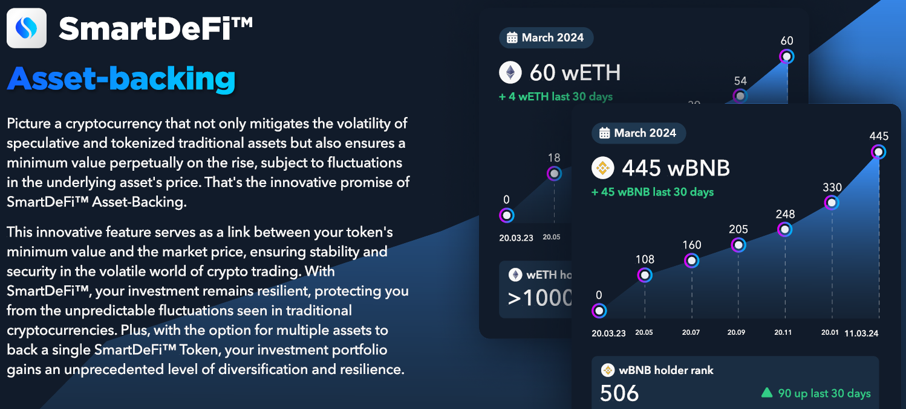

# 💵 资产支持

<figure><figcaption></figcaption></figure>

### SmartDeFi：为动荡市场提供稳定的代币

想象一下，一种**加密货币**不仅受炒作和暴跌的影响，还带有**内置的安全保障**。这正是 SmartDeFi 提供的 **资产支持**。

核心要点如下：

* SmartDeFi 代币的**每笔交易**都会为一个名为资产支持的**储备基金**做出贡献。该基金持有真实资产，如 BNB、USDT 或项目启动时选择的任何其他币种。
* 这个储备**不断增长**，为代币创造一个**底价**。即使市场崩盘，代币的基本价值也不会低于此底价。
* 这种**稳定性**保护您免受**骗局**和**拉高出货**的影响。您可以持有和交易具有真正价值的代币，而不仅仅是瞬间炒作。
* 当人们**燃烧**他们的 SmartDeFi 代币（将其从流通中移除）时，**剩余的代币在未来变得更有价值**。燃烧代币会产生**通缩效应**。

**简而言之，SmartDeFi 提供了：**

* **稳定性：** 您的投资免受市场崩盘的影响。
* **安全性：** 您免于骗局和操控的威胁。
* **增长潜力：** 代币的价值有机会随时间增加。

**可以这样想：**

* **普通加密货币：** 像过山车，既可以上涨也可以归零。
* **SmartDeFi：像一艘坚固的船，能够经受风暴并确保您的代币永远不会价值归零。**

**准备好投资一个更稳定的未来了吗？考虑 SmartDeFi 吧。**
