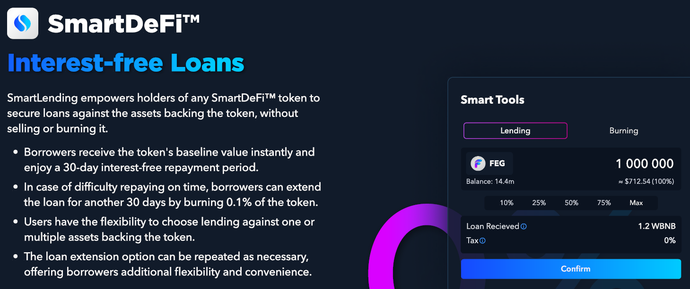

# 🏦 SmartLending

<figure><figcaption></figcaption></figure>

Through _SmartLending_, any SmartDeFi token can be used as collateral to take out loans against its baseline value—without having to sell or burn the Token.

Upon taking the loan, the borrower instantly receives the baseline value for the collateralized Token. The borrower then has **30 days** to repay the loan _without interest_.\
\
If the loan cannot be repaid in time, the user may extend the lending period by another 30 days by burning 0.1% of their collateral and can extend again and again.


Note: Extending the SmartLoan before the 30-day expiration is essential. Otherwise, the loan defaults, and the collateral is burnt (lost).



Because the collateralized tokens are held inside the smart contract and considered part of the circulating supply, they continue to accrue the asset-backing as they would in the investor's wallet. The continued asset-backing accumulation enables SmartLending to be _interest-free._&#x20;


### What Does This Mean?

SmartLending means you can now access your SmartDeFi token's baseline value without selling it. This is perfect for emergencies or taking advantage of a new Token launch without selling your assets.\
\
This means you have freedom and can treat your baseline value as a banked asset.

### How Safe Is It?

SmartLend requires no oracles, as the price comes directly from the baseline value pulled from the smart contract. Furthermore, as SmartLend requires no third party, there is no room for external manipulation or exploits of the code.


**SmartLend is the first lending protocol in which the funds and data for ratio calculations are hosted in the same place, making it the most secure protocol ever created.**


### Is there a tax for lending a SmartDeFi Token?

No, but if a SmartDeFi ™ Token has a reflection tax, lending against it WILL cause that reflection tax to be deducted.

### Why does the Token not show in the wallet after taking a loan?

SmartLend holds the user's Token in the Smart Contract as collateral while lending out the asset-backing token type at the baseline value of the Token. For example, if the Token is asset-backed in wBNB, the loan will be provided in wBNB.

### Do Tokens inside SmartLend receive reflections (RFI)?

**No**, they do not. Once a token Token is used as collateral for a SmartLend loan, the SD tokens do not receive reflections while being held inside the Smart Contract.

### Can I repay in batches?

You can repay in however many batches you want, and you'll also receive your SD token in batches.\
Once a user repays the final batch and thus repays their loan in full, all remaining SD Tokens are returned to the user in their wallet, and the SD tokens will begin again to receive reflections if the Token is reflective (RFI).

