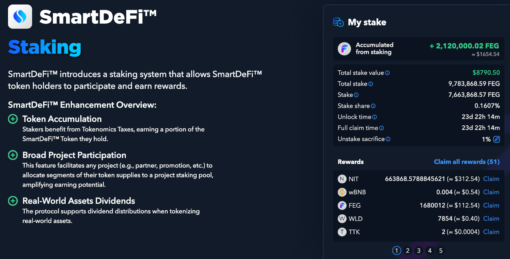

# 🎁 Staking

<figure><figcaption></figcaption></figure>

### Passive Rewards for Holders

Crypto investors always seek ways to maximize their holdings and generate passive rewards, and the Staking Protocol offers an opportunity to do just that. It allows holders to stake their tokens and earn rewards from trading volume on decentralized exchanges such as PancakeSwap or Uniswap.

### Staking Contract Features

<table data-card-size="large" data-column-title-hidden data-view="cards"><thead><tr><th></th><th></th><th data-hidden></th></tr></thead><tbody><tr><td><strong>Staking Contract Customization</strong></td><td>Owners can customize their staking, like deposit and withdrawal fees, fee allocation, unstake delay, and additional rewards.</td><td></td></tr><tr><td><strong>Automatic Reward Distribution</strong></td><td>Rewards are automatically distributed and compounded, meaning users don't need to claim or reinvest their earnings manually.</td><td></td></tr><tr><td><strong>Upgradeable Contract</strong></td><td>The staking contract will be upgraded without users and SD project owners requiring action.</td><td></td></tr><tr><td><strong>Reward Sources</strong></td><td>Rewards can come from trading or from owners who can also manually inject other coin rewards <em>(up to 30 separate rewards)</em></td><td></td></tr><tr><td><strong>SDSS Token</strong></td><td>After staking, users receive SD Stake Shares (SDSS) to represent ownership in the staking pool. For safety, SDSS is not transferable</td><td></td></tr><tr><td><strong>Sacrifice Feature</strong></td><td>Users can choose to burn a percentage of their staking rewards when unstaking to help  decrease the circulating token supply</td><td></td></tr><tr><td>The flexibility of no lock-in period allows you to unstake whenever, or the dev of a project and pick a custom period for their project.</td><td></td><td></td></tr><tr><td>The dev can decide if their project will have a deposit and withdrawal or not to suit their tokenomics better</td><td></td><td></td></tr></tbody></table>

### **Staking Rewards Source & Distribution**

Staking rewards are derived from on-chain trading activities of SmartDeFi projects; they auto-compound and are available to the user at any time.\
\
Also, the project owner can manually inject other token/coin rewards to send to stakers.\
Other token rewards are doled out in rounds and subject to a certain accumulation threshold. Developers can modify the accumulation threshold for rewards, which may differ for each type of reward.\
\
For example, if 1 wBNB is the threshold, rewards are disbursed when the reward pool accumulates 1 wBNB.


Unstaking or adding to one's staking pool within the first 30 days of initial Staking will result in a 50% loss of rewards.\
\- Said forfeited rewards will then be distributed among other stakeholders.&#x20;


### **What is SDSS**

After Staking, your SD tokens will be deposited into the staking contract, and in return, you will get new tokens called SmartDeFi Stake Shares (SDSS). These shares represent your ownership in the staking pool. Think of SDSS as a receipt from the system to confirm you have staked successfully. You will need to show this receipt to the system so it can let you unstake and give back your SD tokens.

* SDSS is not a 1:1 ratio
* SDSS updates with each earned token reward
* Total SDSS / Total SD = Ratio
* It is impossible to transfer SDSS to another wallet.

### Optional "Sacrifice"

The sacrifice feature was introduced in the new Staking contract per community request for those who wish to help with the burn efforts and decrease the circulating token supply.

When unstaking, sakers can burn a specified percentage of their staking rewards, effectively removing them from the circulating supply.

To activate this, you must specify the percentage to sacrifice and the amount to unstake.


At any point before unstaking, you can turn off the sacrifice by setting it to 0% in the Sacrifice settings.

