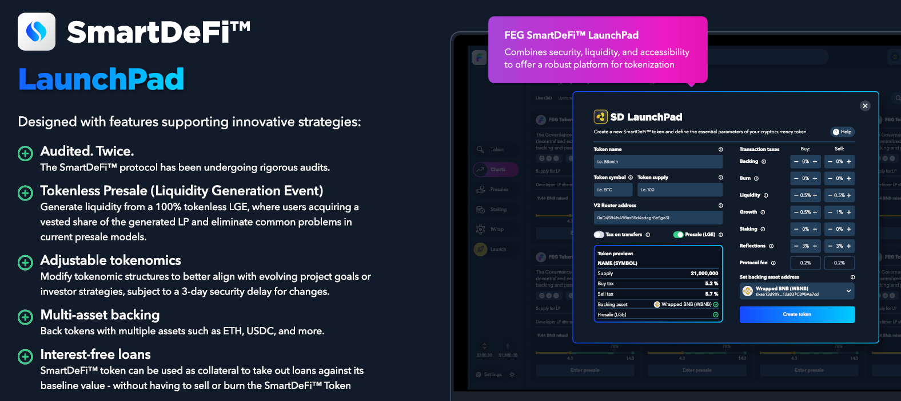

---
layout:
  title:
    visible: true
  description:
    visible: true
  tableOfContents:
    visible: true
  outline:
    visible: true
  pagination:
    visible: true
---

# 🚀 Token Launchpad

<figure><figcaption></figcaption></figure>

### Your Shortcut to Token Creation, Effortlessly

Have you ever dreamed of creating your crypto project but found the technical barriers too high?\
Enter the SmartDeFi Token Launchpad, your ticket to launching a Web3 project in a few clicks without the need for coding expertise.&#x20;

With zero development costs, anyone can launch their idea or project on the ETH or BNB blockchains with a fully audited contract by [PeckShield](https://peckshield.com/) along with the following features:

* [Staking](broken-reference) for passive income
* [Asset Backing](../smartdefi-protocol/asset-backing.md) for guaranteed minimum value
* [Tokenless Presales](presale-launch/) with rug protection
* Frontrun protection
* [Smart Loans](../smartdefi-protocol/smartlending.md) (0% interest for 30 days)
* Track App  for mobile and desktop
* Custom fees to support your project
* &#x20;... and more


For real-time interactions and guidance, join the official Telegram [ t.me/SDlistings](https://t.me/SDlistings)


### The SmartDeFi Advantage

SmartDeFi has been years in the making, and thousands of work hours have been poured into creating this advanced Launchpad, along with a sizeable amount of money invested in making this system a reality. \
The SmartDeFi Launchpad has been thoroughly audited by the top blockchain security company [PeckShield](https://peckshield.com/) and now you can get all of this and create your own project using SmartDeFi essentially for free.\
To assist you in making informed decisions on your new crypto journey, we've compiled concise and valuable pieces of information that you can quickly read to get a feel for how it works:

<table data-card-size="large" data-column-title-hidden data-view="cards"><thead><tr><th></th><th></th><th data-hidden></th></tr></thead><tbody><tr><td><strong>Zero coding knowledge needed</strong></td><td>You can create and launch a project without knowing a single thing about coding, plus even options like staking, loans, lockers, etc.</td><td></td></tr><tr><td><strong>Launch costs</strong></td><td>Minting is FREE, however transactions need gas fees to execute on blockchains. Use gas trackers to monitor these costs <a href="https://bscscan.com/gastracker">BSC</a> / <a href="https://etherscan.io/gastracker">ETH</a></td><td></td></tr><tr><td><strong>Protocol fee</strong></td><td>Creating your project is free, but a small tax takes a percentage from each buy and sell transaction. Currently, the fee is set to 0.5% </td><td></td></tr><tr><td><strong>List your project anywhere</strong></td><td>As long as your specific project fits all their standards for listing you can list on any CEX, DEX, CoinMarketCap, Coingecko and so on</td><td></td></tr><tr><td><strong>Liquidity Pairing</strong></td><td>SmartDeFi tokens can be paired with ANY  coin you wish. Note, at launch the main liquidity pool will be paired with BNB or ETH</td><td></td></tr><tr><td><strong>Liquidity funds</strong></td><td>You can launch using our presale system and  gather liquidity from your investors, or you can inject your own money into liquidity</td><td></td></tr><tr><td><strong>Locked and unlocked liquidity</strong></td><td>Presale liquidity is locked/vested &#x26; releases in batches but liquidity injected manually by the owner is unlocked by default (can be locked)</td><td></td></tr><tr><td><strong>Custom taxes before &#x26; after launch</strong></td><td>Full control over taxes and can set them to  gather funds for marketing, staking, backing, liquidity, development, burns, so on</td><td></td></tr></tbody></table>


Note:  [CoinW](https://www.coinw.com/), a top crypto exchange, has offered to speed up listing of any SmartDeFi project that qualifies for their criteria & meets the listing costs.  [Contact CoinW](https://www.coinw.com/front/login?forwardUrl=%2Ffront%2Fcoinapply) for more.


### So what now?

You can dive deeper into [SmartDeFi](../smartdefi-protocol/) if you wish, or you can [launch your project](create-a-token.md) right now!

