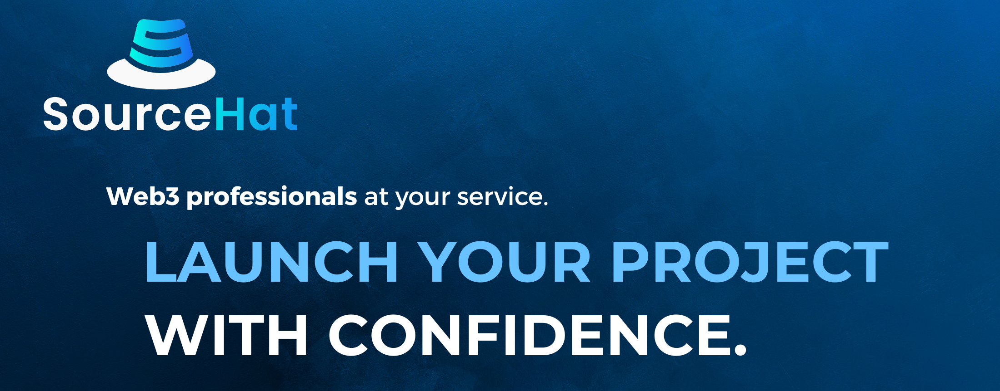

# 🔐 Security Audits

### Search for safety

In light of the growing number of hacks and exploits in the cryptocurrency space, the FEG team has embarked on a rigorous search for a top-tier blockchain security firm capable of conducting in-depth audits of our advanced smart contracts.

### Safety on the horizon

<figure><figcaption></figcaption></figure>

After long & careful consideration, we have selected [PeckShield](https://peckshield.com/) as our main trusted partner for security audits. [PeckShield](https://peckshield.com/)'s reputation for excellence and expertise in auditing sophisticated smart contracts makes them ideal for safeguarding our project and providing our investors with the assurance they deserve.

<figure><figcaption></figcaption></figure>

You want to know what's better than one heavy hitter 3rd party blockchain security company ? Two  companies! As such the team has selected SourceHat as our second Web3 professional partner for doing thorough security audits on all SmartDeFi related contracts, in order to ensure everything is the best it can be, all in the interest of safety.&#x20;


Audit reports will experience updates as future upgrades are being made to existing contracts.


## List of security audits

### 2023-02-10 FEG SmartDeFi v1.1 Audit Report (PeckShield)



### 2023-03-06 FEG Migrator v1.0 Audit Report (PeckShield)



### 2023-07-10 FEG Staking v1.0 Audit Report (PeckShield)



### 2024-05-14 FEG Migrator 2 v1.0 Audit Report (PeckShield)



### 2024-05-14 FEG Bridge v1.0 Audit Report (PeckShield)



### 2024-05-14 FEG Fee Converter v1.0 Audit Report (PeckShield)



### 2024-05-15 New FEG SmartDeFi v1.0 Audit Report (PeckShield)



### 2024-05-29 Evaluation of the SmartDeFi platform (SourceHat)


